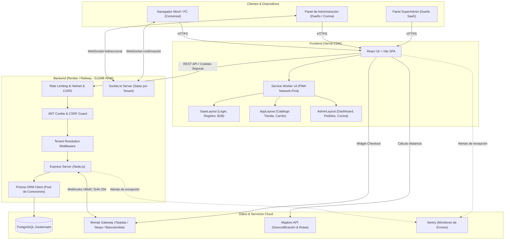

# 🧭 OrderFlow · Cuaderno de Estudio y Manual del Proyecto (Notebox)

Bienvenido a la base de conocimiento y cuaderno de estudio de **OrderFlow**.  
Esta carpeta contiene todas las notas, diagramas y explicaciones técnicas organizadas de forma modular para que puedas aprender, dominar, modificar y defender cada componente de este SaaS de punta a punta.

---

## 📚 Mapa de Contenidos

| Módulo | Archivo | Qué Aprenderás |
| :---: | :--- | :--- |
| **00** | [00_INDICE_Y_GUIA_DE_ESTUDIO.md](file:///c:/Users/villa/OneDrive/Documentos/aplicacion%20web/notebox/00_INDICE_Y_GUIA_DE_ESTUDIO.md) | Visión global, arquitectura general, glosario y plan de estudio de 7 días. |
| **01** | [01_MODELO_DE_NEGOCIO_Y_PRODUCTO.md](file:///c:/Users/villa/OneDrive/Documentos/aplicacion%20web/notebox/01_MODELO_DE_NEGOCIO_Y_PRODUCTO.md) | Dolor del cliente, propuesta de valor (0% comisiones), modelo B2B multi-rubro, paywall de prueba de 14 días y venta comercial. |
| **02** | [02_ARQUITECTURA_GLOBAL_Y_MULTITENANCY.md](file:///c:/Users/villa/OneDrive/Documentos/aplicacion%20web/notebox/02_ARQUITECTURA_GLOBAL_Y_MULTITENANCY.md) | Monorepo desacoplado, aislamiento de inquilinos en base de datos compartida, resolución de dominios/slugs y desacoplamiento de layouts. |
| **03** | [03_FRONTEND_REACT_VITE_Y_PWA.md](file:///c:/Users/villa/OneDrive/Documentos/aplicacion%20web/notebox/03_FRONTEND_REACT_VITE_Y_PWA.md) | React 18, Vite, TanStack Query, PWA Service Worker v4 (Network-First), comanda térmica 80mm y sintetizador de audio. |
| **04** | [04_BACKEND_NODEJS_EXPRESS_Y_PRISMA.md](file:///c:/Users/villa/OneDrive/Documentos/aplicacion%20web/notebox/04_BACKEND_NODEJS_EXPRESS_Y_PRISMA.md) | Node.js, Express, arquitectura por capas, modelo relacional de Prisma, índices de PostgreSQL y manejo de errores. |
| **05** | [05_SEGURIDAD_AUTENTICACION_Y_PERMISOS.md](file:///c:/Users/villa/OneDrive/Documentos/aplicacion%20web/notebox/05_SEGURIDAD_AUTENTICACION_Y_PERMISOS.md) | Tokens JWT en cookies HttpOnly/SameSite, CSRF con doble envío, RBAC, Rate Limiting anti-DDoS y Sentry. |
| **06** | [06_TIEMPO_REAL_PAGOS_Y_LOGISTICA.md](file:///c:/Users/villa/OneDrive/Documentos/aplicacion%20web/notebox/06_TIEMPO_REAL_PAGOS_Y_LOGISTICA.md) | WebSockets por salas de restaurante, pasarela Wompi con webhook criptográfico HMAC SHA-256, Mapbox y WhatsApp. |
| **07** | [07_TESTING_DEVOPS_Y_PRODUCCION.md](file:///c:/Users/villa/OneDrive/Documentos/aplicacion%20web/notebox/07_TESTING_DEVOPS_Y_PRODUCCION.md) | Vitest (55 tests), Playwright E2E (4 tests), pruebas de carga (stress-test), despliegue en Vercel + Render y runbooks. |

---

## 🗺️ Diagrama de la Arquitectura del Sistema

---

## 🗓️ Ruta Sugerida de Estudio (Plan de 7 Días)

Si quieres dominar el proyecto de principio a fin, sigue este orden:

- **Día 1: Visión General y Negocio**  
  Lee los módulos **00** y **01**. Entiende qué problema resuelve OrderFlow, por qué los restaurantes necesitan independizarse de apps de comisión del 25%, cómo opera el trial de 14 días y las etiquetas dinámicas para distintos rubros comerciales.
- **Día 2: Arquitectura y Multi-inquilino**  
  Lee el módulo **02**. Analiza cómo funciona la estrategia multi-tenant con discriminador `restaurantId`, cómo la aplicación resuelve el comercio activo mediante la URL (`/:slug` o `?restaurant=slug`) y cómo se desacoplan los layouts.
- **Día 3: Frontend y PWA**  
  Lee el módulo **03**. Estudia la estructura de carpetas de `frontend/`, cómo React Query cachea datos del menú, el funcionamiento del Service Worker v4 (*Network-First* para evitar HTML obsoleto) y la impresión de comandas térmicas.
- **Día 4: Backend, Base de Datos y Prisma**  
  Lee el módulo **04**. Examina `backend/prisma/schema.prisma`, las relaciones entre modelos, el pooling de conexiones en PostgreSQL para hardware liviano (512MB RAM) y el middleware de errores.
- **Día 5: Seguridad y Autenticación**  
  Lee el módulo **05**. Aprende el flujo de tokens JWT en cookies `httpOnly` + rotación de Refresh Tokens, la protección contra ataques CSRF de doble envío y las políticas de Rate Limiting.
- **Día 6: Tiempo Real y Pagos**  
  Lee el módulo **06**. Descubre cómo Socket.io actualiza las pantallas de cocina al instante, cómo se validan criptográficamente los webhooks de Wompi y cómo se generan mensajes para WhatsApp.
- **Día 7: Calidad, DevOps y Operación**  
  Lee el módulo **07**. Ejecuta las pruebas unitarias (`npm test`), las pruebas E2E con Playwright, el script de estrés y aprende a responder incidentes comunes en producción.

---

## 📖 Glosario Rápido de Conceptos Clave

1. **Multi-tenancy (Multi-inquilino):** Arquitectura donde una sola instancia de software y base de datos atiende a múltiples clientes (negocios), manteniendo los datos de cada uno lógicamente aislados mediante identificadores como `restaurantId`.
2. **PWA (Progressive Web App):** Aplicación web que se comporta como app nativa: se puede instalar en la pantalla de inicio de Android/iOS, funciona sin conexión y envía alertas.
3. **Service Worker:** Script en segundo plano que intercepta las peticiones de red del navegador para decidir si servirlas desde la red, la caché local o un archivo offline.
4. **JWT (JSON Web Token):** Formato estándar de token firmado criptográficamente para representar la identidad del usuario sin consultar la base de datos en cada petición.
5. **Cookie HttpOnly:** Bandera de seguridad que impide que scripts en el navegador (JavaScript / XSS) puedan leer o robar el token de sesión.
6. **Double-Submit CSRF:** Mecanismo donde el servidor envía un valor aleatorio en una cookie y el cliente lo reenvía en una cabecera (`x-csrf-token`), impidiendo que sitios web maliciosos envíen peticiones a nombre del usuario.
7. **Prisma ORM:** Capa de abstracción tipada para Node.js que traduce consultas de JavaScript a sentencias SQL eficientes contra PostgreSQL.
8. **WebSocket:** Canal de comunicación bidireccional y persistente sobre una única conexión TCP, ideal para alertas inmediatas cuando un pedido nuevo entra a la cocina.
9. **HMAC SHA-256:** Código de autenticación de mensajes basado en hash criptográfico, utilizado para asegurar que las notificaciones de pago provengan 100% de la pasarela Wompi.
