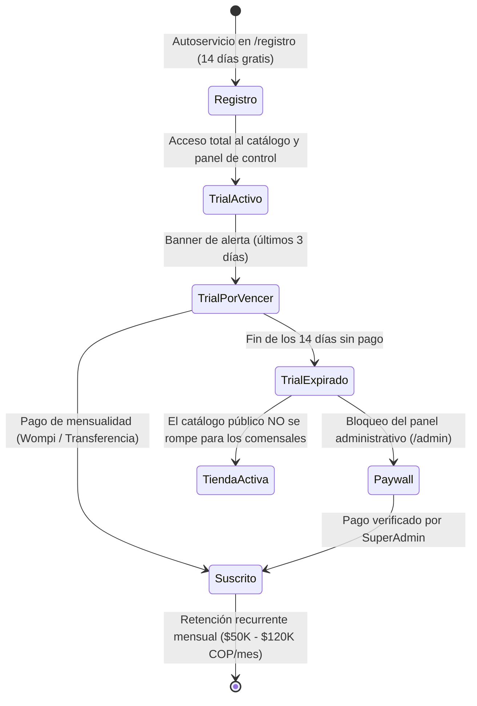

# 💼 Módulo 01 · Modelo de Negocio y Definición de Producto

En este módulo aprenderás el fundamento económico, comercial y funcional de **OrderFlow**. Entenderás por qué existe el producto, qué dolor resuelve, cómo genera dinero y cómo adaptarse a distintos tipos de comercios.

---

## 1. El Problema que Resuelve OrderFlow

En América Latina y mercados emergentes, los restaurantes y comercios locales enfrentan una trampa estructural impuesta por las grandes plataformas de delivery (Rappi, Uber Eats, iFood, PedidosYa):

```
Venta bruta del restaurante:       $100.000 COP
Comisión de la app (25% - 30%):  - $ 28.000 COP
Margen real del restaurante:     Márgenes asfixiados (a veces operan a pérdida)
Datos del cliente (teléfono/email): Quedan en poder de la app, no del restaurante
```

### Los 4 Dolores Críticos del Dueño de Negocio:
1. **Comisiones asfixiantes:** Pagar entre el 20% y el 30% de cada pedido anula casi toda la ganancia neta en comida preparada.
2. **Pérdida de la relación con el cliente:** La plataforma no comparte el teléfono ni el correo del cliente. Si el restaurante cierra o se va de la app, pierde a su clientela.
3. **Falta de identidad de marca propia:** El restaurante compite en un listado infinito contra cientos de locales que compran publicidad dentro de la app.
4. **Desorden operativo con WhatsApp informal:** Tomar pedidos respondiendo mensajes de texto a mano por WhatsApp genera errores en pedidos, direcciones incompletas, platos mal cobrados y clientes esperando hasta 20 minutos por una respuesta.

---

## 2. La Propuesta de Valor de OrderFlow

OrderFlow no es un intermediario; es la **plataforma tecnológica propia del negocio**:

| Característica | Apps Tradicionales (Rappi / Uber) | OrderFlow SaaS |
| :--- | :---: | :---: |
| **Comisión por pedido** | 20% - 30% | **0% (Tarifa plana fija mensual)** |
| **Dominio y Branding** | Página genérica en la app | **URL propia (`orderflowapp.online/tutienda`) y logo propio** |
| **Control de Base de Datos** | La app es dueña de los clientes | **100% propiedad del comercio (nombres, teléfonos, historial)** |
| **Medios de Pago** | Retenciones semanales o quincenales | **Dinero directo a su cuenta (Efectivo, Nequi, Wompi)** |
| **Recepción de Pedidos** | Tableta obligatoria cerrada | **Pantalla de cocina en tiempo real + WhatsApp automático + Comanda 80mm** |

---

## 3. Adaptabilidad Multi-Rubro: Sistema `businessLabels`

Aunque nació pensado para gastronomía, el sistema incluye un motor de etiquetas dinámicas (`frontend/src/utils/businessLabels.js`) que adapta todo el vocabulario de la interfaz automáticamente según el tipo de comercio configurado en `config.businessType`:

```javascript
// frontend/src/utils/businessLabels.js
const BUSINESS_PRESETS = {
  restaurant: {
    businessLabel: "restaurante",
    catalogLabel: "Menú",
    orderLabel: "pedido",
    productLabel: "plato",
    fulfillmentLabel: "domicilio",
    prepAreaLabel: "cocina",
    showTableNumber: true,      // Muestra número de mesa para salón
    showKitchenPanel: true,     // Activa pantalla de cocina KDS
  },
  petshop: {
    businessLabel: "tienda de mascotas",
    catalogLabel: "Catálogo",
    orderLabel: "compra",
    productLabel: "producto",
    fulfillmentLabel: "entrega",
    prepAreaLabel: "bodega",
    showTableNumber: false,
    showKitchenPanel: false,
  },
  grocery: {
    businessLabel: "supermercado",
    catalogLabel: "Despensa",
    orderLabel: "pedido",
    productLabel: "vívere",
    fulfillmentLabel: "domicilio",
    prepAreaLabel: "empaque",
    showTableNumber: false,
    showKitchenPanel: false,
  },
  bookstore: {
    businessLabel: "librería",
    catalogLabel: "Catálogo",
    orderLabel: "compra",
    productLabel: "libro",
    fulfillmentLabel: "envío",
    prepAreaLabel: "despacho",
    showTableNumber: false,
    showKitchenPanel: false,
  }
};
```

Esto permite al dueño del SaaS vender la misma plataforma a pizzerías, farmacias, tiendas naturistas o minimarkets sin tocar una sola línea de código.

---

## 4. Modelo de Monetización y Ciclo de Vida del Cliente (SaaS)

OrderFlow utiliza un modelo de **Suscripción B2B con Prueba Gratuita (Free-Trial SaaS)**:



### Estrategia del Paywall Inteligente (`trialStatus.js`):
Cuando vence el período de 14 días:
1. **La tienda pública sigue recibiendo pedidos**: No se arruinan las ventas de los clientes finales que escanean el código QR en las mesas o entran desde Instagram.
2. **El panel `/admin` bloquea la gestión avanzada**: Al intentar acceder a estadísticas, modificar productos o cambiar estados, aparece el cartel de cobro para renovar la suscripción.
3. Esto crea la urgencia comercial perfecta: el comerciante ve que le entran pedidos reales y paga con gusto para seguir usando el sistema.

---

## 5. El Panel SuperAdmin (`/superadmin`)

El fundador del SaaS dispone de una consola privada de alto nivel para gestionar todo el negocio:
- **Métricas globales:** Total de comercios registrados, pedidos procesados a nivel país, volumen monetario bruto transitado.
- **Gestión de comercios:** Ver fecha de registro de cada negocio, estado de la prueba (días restantes), activar o suspender suscripciones con un clic.
- **Creación asistida:** Posibilidad de registrar un comercio manualmente en caso de acuerdos corporativos o pagos anuales en efectivo.

---

## 6. Guion de Ventas para Captar los Primeros Restaurantes

Cuando salgas a ofrecer OrderFlow a restaurantes de tu zona, utiliza este argumento de 3 pasos:

1. **La Pregunta Reveladora:**  
   *"Buenas tardes, ¿aproximadamente cuántos millones de pesos vendieron el mes pasado por Rappi/iFood? ¿Sabías que de cada millón, ellos se quedaron con $280.000 pesos de tu trabajo?"*
2. **La Demostración en Vivo (30 segundos):**  
   Abres tu teléfono y les muestras `orderflowapp.online/?restaurant=demo-burger`:  
   *"Mira, este es tu propio catálogo digital con tu logo. El cliente escanea el QR en la mesa o entra desde tu Instagram, elige una hamburguesa con adición de tocineta, pone su dirección y el pedido te llega directo a tu cocina y a tu WhatsApp sin pagar 1 solo peso de comisión a nadie."*
3. **La Oferta Sin Riesgo:**  
   *"No tienes que pagarme nada hoy. Te dejo la plataforma configurada con tus 10 platos principales y 14 días gratis. Si en dos semanas ves que ahorraste dinero y tus clientes piden más fácil, la suscripción cuesta menos que un combo de hamburguesa al mes ($70.000 COP)."*
