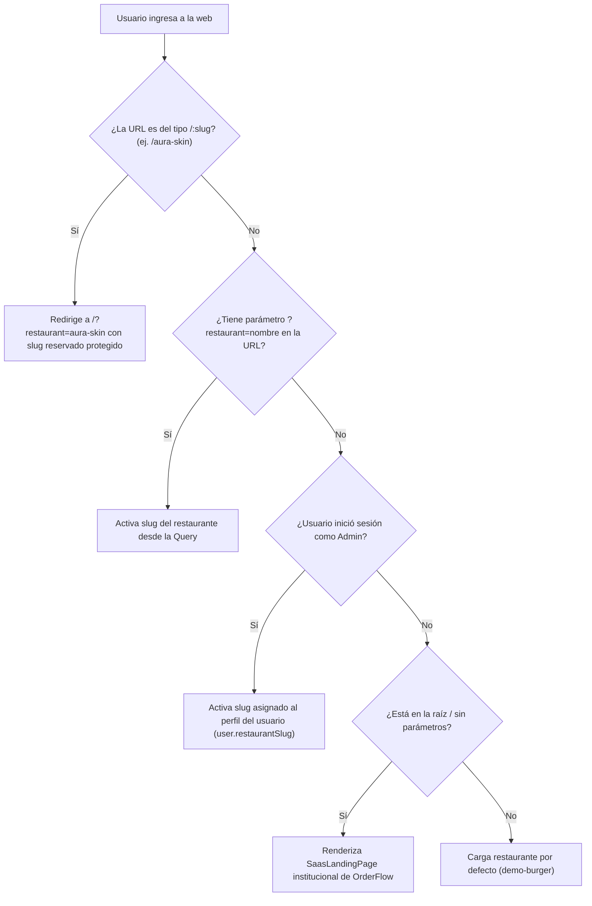
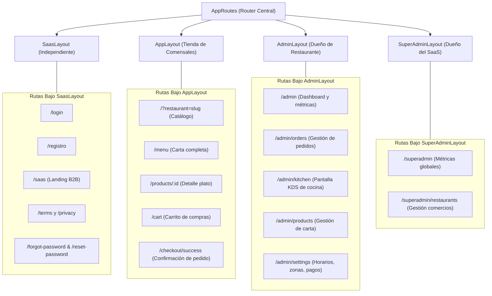

# 🏗️ Módulo 02 · Arquitectura Global y Multi-tenancy

En este módulo comprenderás a fondo cómo está estructurado el monorepo de **OrderFlow**, cómo opera el patrón arquitectónico **Multi-tenant** (multi-inquilino) y cómo se garantiza el aislamiento absoluto de datos entre cientos de negocios distintos.

---

## 1. Estructura del Monorepo

El proyecto está organizado como un monorepo ligero y desacoplado, lo que facilita el desarrollo conjunto sin la sobrecarga de herramientas complejas como TurboRepo o Nx:

```
aplicacion web/
├── frontend/             # Single Page Application (SPA) en React 18 + Vite + Tailwind
│   ├── public/           # Archivos estáticos, iconos SVG, manifiesto PWA y sw.js
│   ├── src/
│   │   ├── components/   # Componentes reutilizables (UI, SEO, Modales, Badges)
│   │   ├── context/      # Proveedores de estado global (Auth, Cart, Config, Toast)
│   │   ├── hooks/        # Custom hooks (useApiQuery, useApiMutation, useSocket)
│   │   ├── layouts/      # Layouts aislados (SaasLayout, AppLayout, AdminLayout, SuperAdminLayout)
│   │   ├── pages/        # Vistas de cliente, administración y superadministración
│   │   ├── routes/       # Definición de rutas protegidas y públicas (AppRoutes.jsx)
│   │   ├── services/     # Clientes HTTP (Axios configurado con interceptores)
│   │   └── utils/        # Utilidades (cálculo trial, businessLabels, formatos moneda)
│   └── package.json
│
├── backend/              # API RESTful en Node.js + Express + Prisma ORM
│   ├── prisma/           # Esquema de base de datos relacional (schema.prisma)
│   ├── src/
│   │   ├── config/       # Variables de entorno validadas y logger Winston
│   │   ├── controllers/  # Controladores HTTP (Auth, Orders, Products, Config, Webhooks)
│   │   ├── middlewares/  # Autenticación JWT, RBAC, CSRF, Rate Limiting, Tenant Guard
│   │   ├── routes/       # Módulos de rutas Express
│   │   ├── services/     # Lógica de negocio pura (Socket emit, Wompi, Ticket generator)
│   │   └── app.js        # Configuración del servidor Express, CORS, Helmet y Sockets
│   ├── scripts/          # Scripts de despliegue, estrés (stress-test) y semillas (seed)
│   └── package.json
│
├── e2e/                  # Pruebas End-to-End con Playwright en navegadores reales
└── notebox/              # Este cuaderno de notas y base de conocimiento técnico
```

---

## 2. Estrategia Multi-tenant en Base de Datos

Existen tres formas clásicas de implementar un SaaS Multi-tenant:

| Estrategia | Descripción | Ventajas | Desventajas |
| :--- | :--- | :--- | :--- |
| **1. BD Aislada por Tenant** | Una base de datos PostgreSQL física independiente para cada restaurante. | Aislamiento físico absoluto. | Costo inmenso, difícil de mantener y migrar en decenas de clientes. |
| **2. Esquema por Tenant** | Una sola BD, pero un schema (`CREATE SCHEMA tenant_x`) por cada restaurante. | Separación lógica fuerte. | Migraciones lentas, límites de conexiones por base de datos. |
| **3. BD Compartida con Discriminador (OrderFlow)** | Todas las tablas comparten la misma base de datos, con una columna `restaurantId` indexada obligatoria en cada registro. | **Costo mínimo de hosting (corre en 512MB RAM), migraciones atómicas en segundos, analítica agregada fácil.** | Requiere disciplina estricta de código para filtrar siempre por `restaurantId`. |

### Cómo Prisma garantiza el aislamiento en cada consulta:
En el backend de OrderFlow, ninguna consulta de lectura o mutación omite el inquilino:

```javascript
// ✅ CORRECTO: Consulta filtrada por inquilino
const products = await prisma.product.findMany({
  where: {
    restaurantId: req.restaurantId,  // Inyectado por el middleware
    isAvailable: true
  },
  include: { category: true }
});

// ❌ PELIGROSO: Nunca se debe consultar sin restaurantId
// const products = await prisma.product.findMany(); // Esto mezclaría platos de otros locales!
```

---

## 3. Resolución de Inquilino en el Frontend (Tenant Resolution)

Cuando un usuario ingresa a la aplicación, ¿cómo sabe el navegador qué restaurante debe cargar?  
El frontend implementa una jerarquía de detección en cascada (`frontend/src/config/env.js` y `RestaurantConfigContext.jsx`):



### Slugs Reservados de la Plataforma:
Para evitar que un restaurante se registre con nombres que colisionen con las rutas del sistema, existe un conjunto de palabras reservadas (`frontend/src/routes/AppRoutes.jsx`):
`saas`, `registro`, `login`, `admin`, `superadmin`, `menu`, `cart`, `checkout`, `profile`, `orders`, `terms`, `privacy`.

---

## 4. Arquitectura de Layouts Desacoplados

Uno de los mayores aprendizajes del proyecto fue la **separación estricta de layouts**. Mezclar la tienda con las páginas del SaaS en un solo componente provocaba que `/login` mostrara elementos del restaurante Demo Burger.

La arquitectura actual implementa 4 layouts especializados e independientes:



### Ventajas de esta separación:
- **Cero fugas visuales:** El layout de autenticación (`SaasLayout`) no importa `DemoBanner`, ni consulta horarios ni zonas de entrega del restaurante.
- **División de código optimizada (Code Splitting):** Vite genera chunks separados para cada layout, reduciendo el peso inicial de carga.
- **Mantenimiento modular:** Puedes rediseñar la landing de ventas de OrderFlow sin riesgo de romper el catálogo de comidas.
