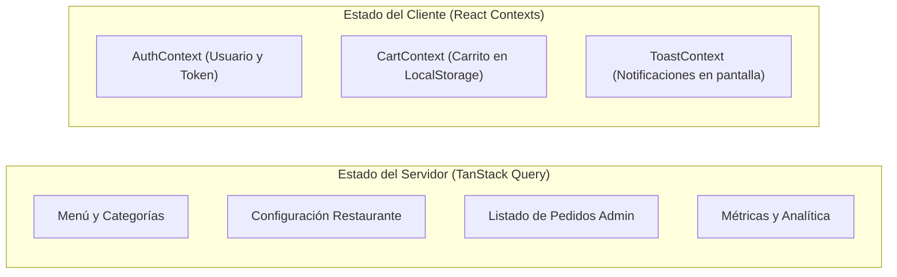

# ⚡ Módulo 03 · Frontend: React 18, Vite, PWA y Experiencia de Usuario

En este módulo aprenderás cómo está construida la interfaz de usuario de **OrderFlow**, cómo se gestiona el estado y la caché, la ingeniería detrás del Service Worker PWA (v4) y las soluciones avanzadas para impresión térmica y alertas sonoras.

---

## 1. Stack Tecnológico del Frontend

- **React 18**: Componentes funcionales, hooks nativos (`useMemo`, `useCallback`, `useContext`) y soporte de transiciones fluidas.
- **Vite 5**: Bundler ultrarrápido basado en ES Modules nativos en desarrollo y Rollup para la generación de código minificado en producción.
- **Tailwind CSS**: Utility-first CSS configurado con variables dinámicas de tema para permitir que cada restaurante tenga sus propios colores corporativos.
- **TanStack Query (React Query v5)**: Gestión del estado del servidor, caché inteligente, reintentos automáticos y sincronización en segundo plano.
- **React Router v6**: Enrutamiento declarativo con lazy loading (`React.lazy`) y carga bajo demanda de páginas (`PageLoader`).
- **Lucide React**: Biblioteca de iconos SVG optimizados en árbol (tree-shakeable).

---

## 2. Gestión de Estado: Servidor vs. Cliente

Una de las decisiones arquitectónicas clave fue no usar Redux ni librerías pesadas, separando el estado en dos naturalezas:



### Por qué TanStack Query para el estado del servidor:
1. **Elimina `useEffect` caóticos:** No necesitas banderas booleanas manuales para saber si una petición está cargando o falló; React Query expone `{ data, isLoading, isError, refetch }`.
2. **Caché con `staleTime`:** La carta del restaurante no cambia cada segundo. Configuramos `staleTime: 5 * 60 * 1000` (5 minutos); si el cliente cambia de pestaña y regresa, el menú se muestra instantáneamente desde la memoria sin hacer peticiones innecesarias a la base de datos.
3. **Optimistic Updates:** Permite cambiar el estado de un pedido en la pantalla de cocina inmediatamente, revirtiendo la interfaz solo si el servidor responde con error.

---

## 3. Theming Dinámico: Marca Propia para Cada Negocio

¿Cómo hace OrderFlow para que un restaurante se vea naranja, una pizzería roja y una tienda de cosméticos morada?  
A través de la inyección de **variables CSS dinámicas** en tiempo de ejecución (`frontend/src/context/RestaurantConfigContext.jsx`):

```javascript
// Al cargar la configuración del comercio:
useEffect(() => {
  if (config.primaryColor) {
    document.documentElement.style.setProperty('--color-primary', config.primaryColor);
  }
  if (config.secondaryColor) {
    document.documentElement.style.setProperty('--color-secondary', config.secondaryColor);
  }
}, [config]);
```

En `frontend/src/styles/theme.css` y `tailwind.config.js`:
```css
:root {
  --color-primary: #ea580c;   /* Naranja por defecto */
  --color-secondary: #18181b; /* Negro carbón */
}

.btn-primary {
  background-color: var(--color-primary);
  color: #ffffff;
}
```
Esto permite que cada botón, badge y acento visual adopte la identidad corporativa del cliente sin recompilar la aplicación.

---

## 4. Ingeniería PWA: El Service Worker v4 (Network-First)

Una Progressive Web App (PWA) permite instalar OrderFlow en el teléfono como si fuera una app de Google Play o App Store. Sin embargo, una mala configuración del Service Worker puede congelar la app en versiones viejas para siempre.

### La Lección de la Caché: De v3 a v4
- **El error de `ff-cache-v3`:** Usaba una estrategia *Cache-First* para todo (`caches.match(request).then(cached => cached || fetch(request))`). Cuando un usuario visitaba `/login`, el navegador guardaba el archivo HTML viejo en disco y nunca lo actualizaba, mostrando el encabezado antiguo de Demo Burger.
- **La solución definitiva en `ff-cache-v4` (`frontend/public/sw.js`):**

```javascript
// frontend/public/sw.js
const CACHE_NAME = 'ff-cache-v4';

// 1. Navegación HTML: Network-First (Consulta la red primero para ver despliegues nuevos)
if (event.request.mode === 'navigate' || event.request.destination === 'document') {
  event.respondWith(
    fetch(event.request)
      .then((response) => {
        if (response.ok) {
          const clone = response.clone();
          caches.open(CACHE_NAME).then((cache) => cache.put(event.request, clone));
        }
        return response;
      })
      .catch(() => caches.match(event.request).then((c) => c || caches.match('/offline')))
  );
  return;
}

// 2. Assets con hash de Vite (/assets/*): Cache-First (Inmutables por definición)
if (url.pathname.startsWith('/assets/')) {
  event.respondWith(
    caches.match(event.request).then((cached) => cached || fetch(event.request))
  );
  return;
}
```

### Purga Automática en el Evento `activate`:
```javascript
self.addEventListener('activate', (event) => {
  event.waitUntil(
    caches.keys().then((keys) =>
      Promise.all(keys.filter((key) => key !== CACHE_NAME).map((key) => caches.delete(key)))
    )
  );
  self.clients.claim();
});
```
Cuando subes una nueva versión con un nombre de caché superior (`v4`), el Service Worker destruye todas las cachés anteriores (`v3`, `v2`) del almacenamiento local del usuario automáticamente.

---

## 5. Impresión de Comandas Térmicas (80 mm)

En restaurantes reales, los cocineros no leen correos electrónicos; necesitan una **comanda en papel de 80 mm** saliendo de su impresora térmica (Epson, Xprinter, etc.).

En `frontend/src/utils/printTicket.js`, implementamos una impresión profesional silenciosa:
1. Se crea un `iframe` oculto en el DOM.
2. Se inyecta un documento HTML optimizado con CSS monocromático `@media print`:
   - Ancho fijado en `72mm` (estándar para papel de 80mm con márgenes seguros).
   - Tipografía monoespaciada de alta legibilidad (`Courier New` o similar).
   - Desglose claro de ítems, modificaciones (ej. "Sin cebolla, queso extra"), dirección de entrega y código QR del pedido.
3. Se invoca `iframe.contentWindow.print()` y se remueve el `iframe` tras completarse la impresión.

---

## 6. Alerta Sonora de Cocina sin Archivos Externos (Web Audio API)

Cuando entra un pedido nuevo a la cocina, los cocineros necesitan escuchar una campanilla fuerte. Si usas un archivo `chime.mp3`, puede fallar por problemas de red o bloqueos de CORS.

En `frontend/src/utils/audioAlert.js`, creamos un sintetizador de audio puro usando el **Web Audio API** nativo del navegador:

```javascript
export function playOrderAlert() {
  const AudioContext = window.AudioContext || window.webkitAudioContext;
  if (!AudioContext) return;

  const ctx = new AudioContext();
  const now = ctx.currentTime;

  // Secuencia de dos tonos tipo campanilla armónica (Frecuencias 587.33Hz -> 880Hz)
  const notes = [
    { freq: 587.33, start: now, duration: 0.15 },
    { freq: 880.00, start: now + 0.12, duration: 0.35 }
  ];

  notes.forEach(({ freq, start, duration }) => {
    const osc = ctx.createOscillator();
    const gain = ctx.createGain();

    osc.type = 'sine'; // Onda senoidal limpia tipo campana
    osc.frequency.setValueAtTime(freq, start);

    gain.gain.setValueAtTime(0.3, start);
    gain.gain.exponentialRampToValueAtTime(0.001, start + duration);

    osc.connect(gain);
    gain.connect(ctx.destination);

    osc.start(start);
    osc.stop(start + duration);
  });
}
```
**Ventaja:** Pesa 0 KB, no depende de conexión a internet y suena al instante con latencia de 0 milisegundos.
