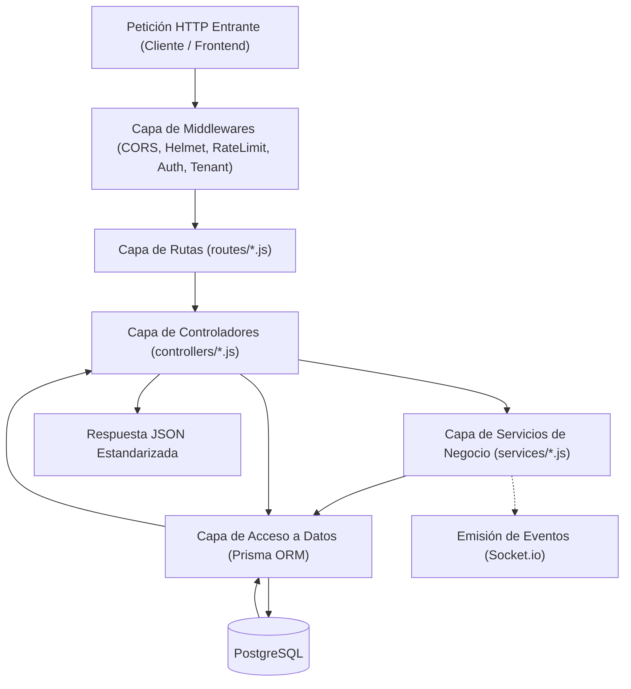
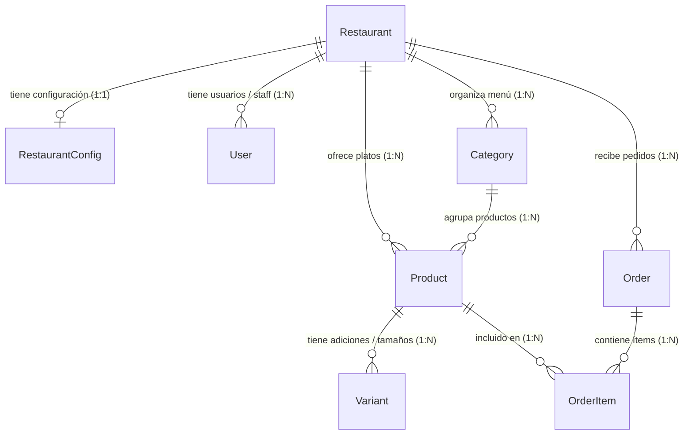

# ⚙️ Módulo 04 · Backend: Node.js, Express y Modelado con Prisma ORM

En este módulo estudiarás la arquitectura interna del servidor de **OrderFlow**, el diseño relacional de la base de datos en PostgreSQL, cómo optimizar consultas con índices y la gestión profesional de errores.

---

## 1. Stack y Arquitectura por Capas del Backend

El backend sigue el patrón de **Arquitectura en Capas (Layered Architecture)**, separando estrictamente la recepción de la petición, la lógica de negocio y el acceso a los datos:



### Funciones de cada capa:
1. **`middlewares/`**: Valida que la petición sea segura, que el token JWT sea auténtico y que el inquilino (`req.restaurantId`) exista antes de llegar a la lógica.
2. **`routes/`**: Declara las URLs disponibles y qué middlewares aplican a cada una.
3. **`controllers/`**: Extrae datos de `req.body`, `req.params` y `req.query`, llama a la base de datos y envía el código HTTP apropiado (`200 OK`, `201 Created`, `400 Bad Request`, `404 Not Found`).
4. **`services/`**: Aloja operaciones que involucran lógica externa (notificaciones por WebSockets, emisión de tickets térmicos, comunicación con pasarelas de pago).
5. **`prisma/`**: Ejecuta las sentencias SQL fuertemente tipadas contra PostgreSQL.

---

## 2. El Modelo Relacional de Datos (`schema.prisma`)

El esquema de la base de datos (`backend/prisma/schema.prisma`) modela toda la operación del SaaS. A continuación se presentan las entidades nucleares y sus relaciones:



### Detalle de los Modelos Clave:

#### 1. `Restaurant` & `RestaurantConfig`
Representa el inquilino (tenant). La configuración visual y operativa se guarda vinculada al restaurante:
```prisma
model Restaurant {
  id                 String            @id @default(cuid())
  name               String
  slug               String            @unique
  isActive           Boolean           @default(true)
  trialEndsAt        DateTime?
  subscriptionStatus String            @default("TRIAL") // TRIAL, ACTIVE, PAST_DUE, CANCELLED
  createdAt          DateTime          @default(now())
  config             RestaurantConfig?
  users              User[]
  categories         Category[]
  products           Product[]
  orders             Order[]
}
```

#### 2. `Order` & `OrderItem`
Modela el pedido desde que el comensal lo solicita hasta que se entrega:
```prisma
model Order {
  id                  String      @id @default(cuid())
  orderNumber         Int         // Número consecutivo legible (ej. #101)
  status              OrderStatus @default(PENDING) // PENDING, PREPARING, READY, DELIVERED, CANCELLED
  paymentMethod       String      // CASH, NEQUI, CARD
  paymentStatus       String      @default("PENDING") // PENDING, APPROVED, REJECTED
  subtotal            Int
  deliveryFeeApplied  Int         @default(0)
  discountAmount      Int         @default(0)
  total               Int
  customerName        String
  customerPhone       String
  customerAddress     String?
  deliveryZoneName    String?
  notes               String?
  restaurantId        String
  restaurant          Restaurant  @relation(fields: [restaurantId], references: [id])
  items               OrderItem[]
  createdAt           DateTime    @default(now())

  @@index([restaurantId, createdAt])
  @@index([restaurantId, status])
}
```

---

## 3. Optimización con Índices para Hardware Liviano (512MB RAM)

Dado que la instancia de producción en Render Starter cuenta con **0.5 vCPU y 512MB de memoria RAM**, cada consulta a la base de datos debe ser quirúrgica. Si la base de datos hace escaneos completos de tabla (*Sequential Scan*), la CPU se satura y la app se congela.

### Los Índices Compuestos Estratégicos:
```prisma
// En el modelo Product:
@@index([restaurantId, isAvailable])

// En el modelo Order:
@@index([restaurantId, status])
@@index([restaurantId, createdAt])
```

### ¿Por qué son vitales?
- Cuando la pantalla de cocina solicita `WHERE restaurantId = 'x' AND status = 'PREPARING'`, PostgreSQL no lee las miles de filas de otros restaurantes; va directo mediante el **Index Scan**, respondiendo en menos de **15 milisegundos**.
- Esto es lo que permite que una máquina de $7 USD soporte cientos de pedidos concurrentes sin despeinarse.

---

## 4. Manejo Centralizado de Errores (`errorHandler.js`)

En `backend/src/middlewares/errorHandler.js`, todos los errores no controlados son interceptados por un único middleware Express:

```javascript
export function errorHandler(err, req, res, next) {
  // 1. Registro con Winston
  logger.error(`${req.method} ${req.originalUrl} - ${err.message}`, { stack: err.stack });

  // 2. Traducción de errores conocidos de Prisma ORM
  if (err.code === 'P2002') {
    // Unique constraint violada (ej. email duplicado o slug ya en uso)
    const target = err.meta?.target ? err.meta.target.join(', ') : 'campo único';
    return res.status(409).json({
      error: 'Conflicto de datos',
      message: `Ya existe un registro con ese valor en: ${target}`
    });
  }

  if (err.code === 'P2025') {
    // Registro no encontrado para actualizar o eliminar
    return res.status(404).json({
      error: 'No encontrado',
      message: 'El registro solicitado no existe en la base de datos'
    });
  }

  // 3. Errores de Validación (Joi / celebrate)
  if (err.isJoi || err.name === 'ValidationError') {
    return res.status(400).json({
      error: 'Datos inválidos',
      message: err.message,
      details: err.details
    });
  }

  // 4. Respuesta genérica segura en producción (no filtra trazas del sistema)
  const isProd = process.env.NODE_ENV === 'production';
  return res.status(err.status || 500).json({
    error: 'Error interno del servidor',
    message: isProd ? 'Ocurrió un error inesperado al procesar tu solicitud.' : err.message
  });
}
```
**Regla de Oro de Seguridad:** En producción (`NODE_ENV === 'production'`), el usuario nunca recibe el `stack` trace ni nombres de tablas internas de PostgreSQL, evitando la fuga de información técnica a posibles atacantes.
