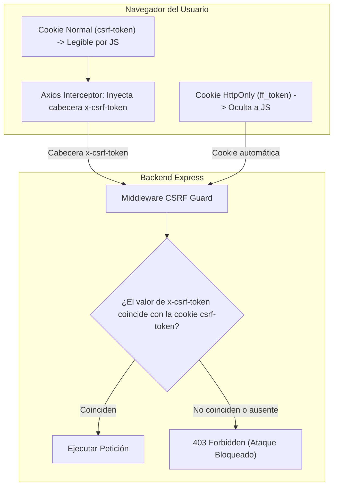

# 🛡️ Módulo 05 · Seguridad, Autenticación y Control de Acceso (RBAC)

En este módulo aprenderás las defensas de seguridad de nivel bancario implementadas en **OrderFlow**: gestión de sesiones con JWT y cookies HttpOnly, mitigación de ataques XSS y CSRF, control de permisos por roles y limitación de tasa contra ataques de fuerza bruta.

---

## 1. El Dilema de los Tokens: ¿LocalStorage o Cookies HttpOnly?

Muchos desarrolladores novatos guardan el token JWT en `localStorage.setItem('token', jwt)`.  
**Eso es una vulnerabilidad crítica de seguridad:** si un atacante logra inyectar un script malicioso (vía XSS, una extensión del navegador o una dependencia npm comprometida), puede ejecutar `localStorage.getItem('token')` y robar la sesión completa del dueño del restaurante.

### La Solución en OrderFlow: Cookies HttpOnly y Rotación de Tokens

```mermaid
sequenceDiagram
    autonumber
    actor User as Usuario (Admin / Dueño)
    participant Front as Frontend (React)
    participant Back as Backend (Express)
    participant DB as PostgreSQL

    User->>Front: Ingresa email y contraseña
    Front->>Back: POST /api/auth/login
    Back->>DB: Verifica contraseña con bcrypt (hash)
    DB-->>Back: Contraseña válida
    Back->>DB: Guarda Refresh Token rotativo (7 días)
    Note over Back,Front: Servidor emite dos cookies protegidas:<br/>1. ff_token (Access Token JWT - 15 min)<br/>2. ff_refresh (Refresh Token - 7 días)
    Back-->>Front: Set-Cookie: ff_token; HttpOnly; Secure; SameSite=None
    Front-->>User: Acceso concedido al panel /admin
    
    Note over Front,Back: 15 minutos después: Access Token expira
    Front->>Back: POST /api/auth/refresh (El navegador envía ff_refresh solo)
    Back->>DB: Valida Refresh Token en BD y rota por uno nuevo
    Back-->>Front: Set-Cookie: nuevo ff_token
```

### ¿Por qué esta arquitectura es invulnerable a XSS?
Al tener la bandera `HttpOnly: true`, **ningún código JavaScript en el navegador puede leer ni alterar la cookie**. Aunque un atacante logre inyectar un script en la página, no podrá extraer el token de sesión.

---

## 2. Protección Anti-CSRF (Doble Envío de Cookie)

Un ataque **CSRF (Cross-Site Request Forgery)** ocurre cuando una víctima autenticada en OrderFlow entra en una web maliciosa de un atacante, y dicha web envía una petición oculta a `https://orderflowapp.online/api/products/delete/123`.  
Dado que el navegador envía automáticamente las cookies asociadas al dominio, la petición se ejecutaría a menos que exista protección CSRF.

### El Patrón Double-Submit Cookie implementado:


**Por qué neutraliza el ataque:** La política de mismo origen (*Same-Origin Policy*) prohíbe que el sitio malicioso del atacante lea el contenido de la cookie `csrf-token`. Como el atacante no puede leerla, no puede incluirla en la cabecera `x-csrf-token`, y el servidor descarta el ataque de inmediato.

---

## 3. Control de Acceso Basado en Roles (RBAC)

OrderFlow cuenta con una jerarquía estricta de permisos dividida en 5 roles (`Role` en `schema.prisma`):

| Rol | Alcance | Rutas Permitidas | Caso de Uso |
| :--- | :--- | :--- | :--- |
| **`SUPERADMIN`** | Toda la plataforma | `/superadmin/**` | El fundador del SaaS: ve métricas globales, crea y desactiva restaurantes. |
| **`ADMIN`** | Un restaurante (`restaurantId`) | `/admin/**` | El dueño del restaurante: gestiona menú, zonas de entrega, staff y reportes. |
| **`KITCHEN`** | Un restaurante (`restaurantId`) | `/admin/kitchen` | El cocinero / parrillero: ve comandas entrantes y cambia pedidos a "Listo". |
| **`WAITER`** | Un restaurante (`restaurantId`) | `/admin/orders` | Meseros: toman pedidos en sala y asignan número de mesa. |
| **`CUSTOMER`** | Sus propios pedidos | `/profile`, `/orders` | El comensal: consulta el estado de su comida y su historial de compras. |

### Middlewares de Protección de Rutas:
```javascript
// backend/src/middlewares/auth.middleware.js
export function requireAdmin(req, res, next) {
  if (!req.user || (req.user.role !== 'ADMIN' && req.user.role !== 'SUPERADMIN')) {
    return res.status(403).json({ error: 'Acceso denegado: se requieren privilegios de administrador' });
  }
  next();
}

export function requireSuperAdmin(req, res, next) {
  if (!req.user || req.user.role !== 'SUPERADMIN') {
    return res.status(403).json({ error: 'Acceso restringido al superadministrador' });
  }
  next();
}
```

---

## 4. Hardening y Protección Anti-DDoS

Para proteger la infraestructura de bajo costo (512MB RAM) contra intentos de saturación maliciosa o ataques de fuerza bruta, el servidor cuenta con cuatro anillos de defensa:

### 1. Cabeceras de Seguridad con Helmet
```javascript
app.use(helmet({
  contentSecurityPolicy: false, // Permitido para cargar widgets de Wompi y mapas Mapbox
  crossOriginEmbedderPolicy: false,
}));
```
Oculta la cabecera `X-Powered-By: Express` (evita revelar la versión del servidor) y previene ataques de Clickjacking forzando `X-Frame-Options`.

### 2. Rate Limiting Agresivo en Autenticación (`express-rate-limit`)
```javascript
export const loginLimiter = rateLimit({
  windowMs: 15 * 60 * 1000, // Ventana de 15 minutos
  max: 5,                   // Máximo 5 intentos fallidos por IP
  message: { error: 'Demasiados intentos fallidos. Intenta nuevamente en 15 minutos.' },
  standardHeaders: true,
  legacyHeaders: false,
});
```
Si un bot intenta adivinar contraseñas probando un diccionario de claves, su dirección IP queda bloqueada en el quinto intento.

### 3. Rate Limiting General de API
Limita a cada cliente a un máximo de 200 peticiones por minuto para endpoints públicos de catálogo (`/api/menu`, `/api/restaurant-config`), respondiendo con código HTTP `429 Too Many Requests` en menos de 10 ms para evitar colas en la base de datos.

### 4. Soporte Detrás de Proxy Inverso (`trust proxy: 1`)
```javascript
app.set('trust proxy', 1);
```
Cuando el backend corre en Render o Railway, las peticiones pasan por un balanceador de carga. Esta instrucción asegura que el Rate Limiter capture la **IP real del usuario** (desde `X-Forwarded-For`) y no la IP del balanceador de Render.
