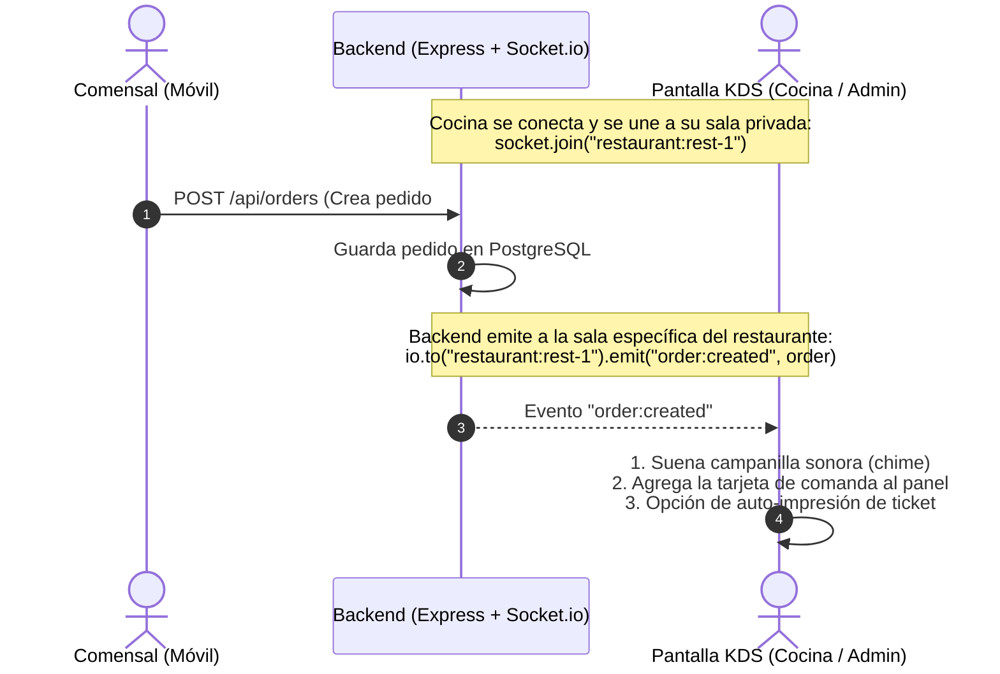
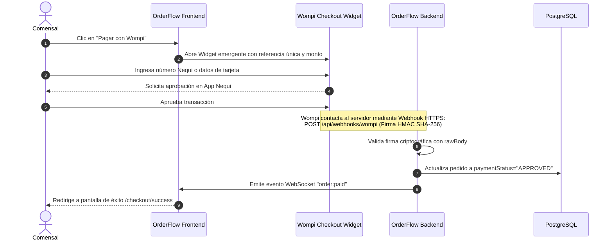

# 🛰️ Módulo 06 · Tiempo Real, Pasarela de Pagos (Wompi) y Logística

En este módulo aprenderás cómo funciona el motor de eventos en tiempo real con WebSockets, cómo se integra la pasarela de pagos Wompi con validación criptográfica de webhooks y la logística de domicilios vía Mapbox y WhatsApp.

---

## 1. Comunicación en Tiempo Real con WebSockets (Socket.io)

### ¿Por qué NO usar HTTP Polling cada 3 segundos?
En muchas aplicaciones básicas, el frontend hace un `setInterval(() => fetch('/api/orders'), 3000)`.  
En un servidor pequeño de **512MB de RAM**, si tienes 10 pantallas de cocina abiertas, esto genera **200 consultas por minuto a PostgreSQL**, saturando la CPU con peticiones donde la mayoría de las veces "no hay nada nuevo".

### La Solución: WebSockets con Salas Segmentadas por Inquilino



### Seguridad en Salas Multi-Tenant:
Un cocinero del restaurante *Demo Burger* nunca escuchará las alertas ni verá los pedidos de *Pizza Roma*. Al conectarse, el servidor valida el token JWT del usuario y únicamente le permite unirse a la sala que corresponde a su `user.restaurantId`.

---

## 2. Pasarela de Pagos Wompi (Colombia)

Para cobros digitales en Colombia, OrderFlow se integra con **Wompi** (pasarela oficial de Bancolombia), permitiendo a los clientes pagar con **Nequi** (notificación push al celular), **Tarjetas de Crédito/Débito**, **PSE** (cuentas bancarias) y **Efectivo** (Corresponsales Bancolombia).

### El Flujo de Pago Completo:



---

## 3. Seguridad de Webhooks: Validación Criptográfica HMAC SHA-256

Nunca debes confiar en un webhook que solo envíe datos en JSON sin validar su autenticidad; cualquier atacante podría enviar una petición falsa diciendo `status: "APPROVED"` para llevarse comida gratis.

### Cómo valida OrderFlow la firma de Wompi:
Wompi concatena valores clave de la transacción junto con un secreto privado de integridad (`WOMPI_INTEGRITY_SECRET`) y genera un hash SHA-256:

```javascript
// backend/src/controllers/webhook.controller.js
import crypto from 'crypto';

export async function handleWompiWebhook(req, res) {
  const { event, data, signature, timestamp } = req.body;
  const checksum = signature.checksum;
  const properties = signature.properties; // Ej: ['transaction.id', 'transaction.status', 'transaction.amount_in_cents']

  // 1. Reconstruir la cadena exacta con los valores de la transacción
  let stringToSign = '';
  properties.forEach((prop) => {
    const value = getNestedValue(data, prop);
    stringToSign += value;
  });

  // 2. Concatenar el timestamp y el secreto de integridad privado
  stringToSign += timestamp + process.env.WOMPI_INTEGRITY_SECRET;

  // 3. Generar el hash SHA-256 en el backend
  const calculatedChecksum = crypto.createHash('sha256').update(stringToSign).digest('hex');

  // 4. Comparación en tiempo constante para prevenir timing attacks
  if (calculatedChecksum !== checksum) {
    logger.warn('Firma de webhook de Wompi inválida. Petición descartada.');
    return res.status(401).json({ error: 'Firma no autorizada' });
  }

  // 5. Firma válida: procedemos a cambiar el estado del pedido a APROBADO
  if (data.transaction.status === 'APPROVED') {
    await orderService.markAsPaid(data.transaction.reference, data.transaction.id);
  }

  return res.status(200).json({ received: true });
}
```

---

## 4. Logística y Georreferenciación con Mapbox

Para el cálculo de costos de entrega, OrderFlow soporta dos modalidades complementarias:

### 1. Zonas de Entrega Fijas (`DeliveryZone`):
Configurables por el restaurante desde su panel de administración (`/admin/settings`):
- *Zona Norte*: $5.000 COP (Tiempo estimado: 30-40 min)
- *Zona Sur*: $8.000 COP (Tiempo estimado: 45-60 min)
- *Cobertura Restringida*: Permite deshabilitar zonas temporalmente en días de lluvia o alta congestión.

### 2. Geocodificación y Cálculo de Distancia con Mapbox:
En `frontend/src/components/cart/MapboxAddressInput.jsx`:
- El cliente escribe su dirección ("Calle 72 # 11-20") y el autocompletado de **Mapbox Geocoding API** sugiere direcciones válidas con coordenadas exactas `[lat, lng]`.
- Se calcula la distancia euclidiana o vial con la tienda mediante la **Mapbox Matrix API**. Si el comensal está fuera del radio máximo de entrega (ej. más de 8 km), el sistema le advierte amablemente antes de pagar.

---

## 5. El Generador Inteligente para WhatsApp

En América Latina, la gran mayoría de los repartidores y clientes se comunican por WhatsApp.  
En `frontend/src/utils/whatsappOrder.js`, la plataforma genera un enlace dinámico `https://wa.me/57XXXXXXXXXX?text=...` con el formato perfecto para el domiciliario:

```
🍔 *NUEVO PEDIDO #101* - Demo Burger
------------------------------------
👤 *Cliente:* Juan Pérez
📱 *Teléfono:* +57 300 123 4567
📍 *Dirección:* Calle 123 #45-67 (Apto 402)
🗺️ *Ubicación Maps:* https://maps.google.com/?q=4.653,-74.083

📋 *DETALLE DEL PEDIDO:*
• 1x Hamburguesa Doble Carne ($22.000)
  _Notas: Sin cebolla, adición de tocineta_
• 1x Gaseosa 355ml ($3.000)

💰 *Subtotal:* $25.000 COP
🛵 *Domicilio (Norte):* $5.000 COP
💵 *TOTAL A PAGAR:* $30.000 COP (Efectivo)
```
**Impacto:** El repartidor no tiene que preguntar "¿dónde queda el apto?" ni escribir la dirección manualmente en Waze; solo toca el enlace y sale a entregar el pedido.
