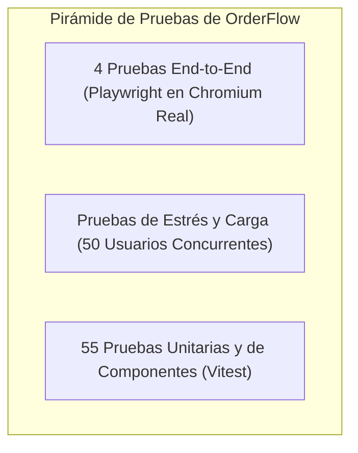
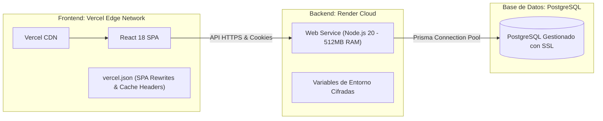

# 🚀 Módulo 07 · Testing, DevOps, Despliegue Cloud y Operaciones

En este módulo aprenderás cómo se garantiza la calidad de software en **OrderFlow**, cómo se ejecutan las pruebas automáticas y de estrés, la configuración de la infraestructura en producción (Vercel + Render + PostgreSQL) y la guía de resolución de incidentes (Runbook).

---

## 1. La Pirámide de Calidad y Pruebas

Para asegurar que ninguna actualización rompa pedidos en vivo, OrderFlow cuenta con tres capas de pruebas automatizadas:



### 1. Pruebas Unitarias (Vitest + Testing Library)
Ubicadas en `frontend/src/test/`. Se ejecutan en segundos sin levantar servidores:
- `trial.test.jsx`: Cálculo de días de prueba y detección de expiración.
- `cart.test.jsx`: Cálculo matemático de subtotales, cupones y variantes.
- `SaasLayout.test.jsx`: Garantiza que `/login` tenga el header limpio de OrderFlow y nunca contenga elementos de Demo Burger.
- `ProtectedRoute.test.jsx`: Valida redirecciones cuando el usuario no está autenticado o carece del rol necesario.

Para correrlas:
```powershell
cd "c:\Users\villa\OneDrive\Documentos\aplicacion web\frontend"
npm test
```

### 2. Pruebas End-to-End (Playwright en Navegador Real)
Ubicadas en `e2e/`. Levantan un navegador Chromium headless y simulan a usuarios reales interactuando con la interfaz:
1. `admin filtra y cambia estado de pedidos`: El administrador inicia sesión, filtra pedidos por estado y aprueba comandas.
2. `superadmin ve lista de restaurantes`: Acceso a la consola global y validación de métricas.
3. `pantalla de login y registro muestra layout limpio de OrderFlow sin Demo Burger`: Valida la ausencia de banners de prueba en páginas institucionales.
4. `completa pedido como invitado y administrador lo gestiona`: Flujo completo desde la selección del plato en el menú, llenado del carrito, checkout y confirmación.

Para correrlas:
```powershell
cd "c:\Users\villa\OneDrive\Documentos\aplicacion web\e2e"
npx playwright test
```

---

## 2. Pruebas de Estrés y Carga Concurrente (`stress-test.js`)

Se evaluó la capacidad de respuesta del backend bajo condiciones reales simulando **50 usuarios concurrentes** haciendo solicitudes masivas con IPs simuladas (`X-Forwarded-For`) en `backend/scripts/stress-test.js`.

### Resultados Reales en Hardware de $7 USD (0.5 vCPU / 512MB RAM):

| Endpoint Evaluado | Concurrencia | Solicitudes | Tasa de Éxito | Tiempo Promedio | Throughput |
| :--- | :---: | :---: | :---: | :---: | :---: |
| **`/api/menu`** (Lectura pesada de BD con categorías y variantes) | 50 concurrentes | 100 | **100%** | **122.1 ms** | **345 req/s** |
| **`/api/restaurant-config`** (Configuración del comercio) | 50 concurrentes | 100 | **100%** | **44.8 ms** | **1,010 req/s** |
| **`/api/health`** (Health check de latencia base del servidor) | 50 concurrentes | 50 | **100%** | **17.2 ms** | **2,500 req/s** |

- **Tasa de Éxito Global:** **100%** (250/250 peticiones exitosas).
- **Errores de conexión o caídas de BD:** **0**.
- **Comportamiento del Rate Limiting:** Cuando una sola IP abusiva supera el umbral de 200 peticiones por minuto, el middleware responde con código `429 Too Many Requests` en menos de **10 ms**, protegiendo la memoria RAM de Render.

---

## 3. Infraestructura Cloud y Despliegue en Producción



### Configuración del Frontend (`vercel.json`):
Para evitar el clásico error `404 Not Found` cuando un usuario recarga una ruta como `/menu` o `/login` en una Single Page Application (SPA), `vercel.json` implementa reescrituras automáticas al punto de entrada `index.html`:
```json
{
  "rewrites": [
    {
      "source": "/((?!assets/|icons/|favicon.ico|manifest.json|sw.js).*)",
      "destination": "/index.html"
    }
  ],
  "headers": [
    {
      "source": "/assets/(.*)",
      "headers": [
        { "key": "Cache-Control", "value": "public, max-age=31536000, immutable" }
      ]
    }
  ]
}
```

### Configuración del Backend en Render (`render.yaml`):
```yaml
services:
  - type: web
    name: fastfood-saas-backend
    env: node
    plan: starter # 0.5 vCPU, 512MB RAM ($7/mes)
    buildCommand: cd backend && npm install && npx prisma generate && npx prisma db push
    startCommand: cd backend && npm run start
    healthCheckPath: /api/health
```

---

## 4. Runbook de Operaciones: Resolución de Incidentes Comunes

### Incidente 1: Un cliente o comerciante ve una versión vieja de la app
- **Causa:** El Service Worker del navegador tiene en caché local un bundle anterior (`ff-cache-v3`).
- **Solución Automática:** Con la versión `ff-cache-v4`, el Service Worker purga cachés antiguas al activarse y consulta la red primero (*Network-First*).
- **Solución Manual de Emergencia:** Pedir al usuario hacer un refresco forzado (`Ctrl + F5` en PC o vaciar caché del sitio en Chrome móvil).

### Incidente 2: Error 500 "Can't reach database server at..."
- **Causa:** El pool de conexiones de PostgreSQL se saturó o la base de datos se durmió por inactividad.
- **Solución:**
  1. Revisar la cadena `DATABASE_URL` en las variables de entorno de Render.
  2. Verificar que `connection_limit=10` esté configurado en la URL de conexión para evitar que Node.js cree más hilos de los que PostgreSQL puede soportar.
  3. Ejecutar `node backend/scripts/deploy-verify.js` para diagnosticar la conectividad en 5 segundos.

### Incidente 3: El cliente pagó en Wompi pero el pedido sigue "PENDING"
- **Causa:** El webhook de Wompi no pudo contactar al servidor (ej. URL del webhook mal configurada en el panel de Wompi o firma inválida).
- **Solución:**
  1. Abrir la consola de Sentry o los logs de Render y buscar `handleWompiWebhook`.
  2. Verificar que el secreto `WOMPI_INTEGRITY_SECRET` en Render coincida exactamente con el del dashboard de Wompi.
  3. Como medida de respaldo, el SuperAdmin o Administrador puede marcar el pedido como "Pagado Manualmente" desde su panel de control con un solo clic.
