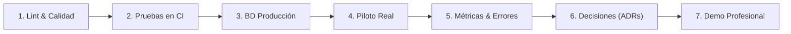

# 🚀 OrderFlow · Guía de Hardening, Pruebas con Usuarios Reales y Demo Profesional

Este documento consolida el salto de **OrderFlow** de un proyecto de código a un producto de software robusto, auditable y listo para validación de mercado o sustentación de grado.

---

## 📋 Los 7 Pilares de Hardening del Proyecto



---

## 1. Verificación de Lint y Estándares de Código

Ambos proyectos (`frontend` y `backend`) cuentan con analizadores estáticos basados en ESLint 9/10 y reglas de React Hooks.

* **Backend:**
  ```bash
  cd backend
  npm run lint
  ```
  *Resultado:* **0 errores, 0 advertencias**.
* **Frontend:**
  ```bash
  cd frontend
  npm run lint
  ```
  *Resultado:* **0 errores, 0 advertencias**. Se eliminaron variables sin usar y se desacopló el formulario de configuración en un componente keyed (`SettingsForm`) para respetar el ciclo de vida de React 19 sin efectos secundarios en render.

---

## 2. Ejecución de Pruebas en Integración Continua (CI)

La suite de pruebas automatizadas se ejecuta tanto localmente como en GitHub Actions (`.github/workflows/ci.yml`).

| Capa | Herramienta | Tests Totales | Archivos de Prueba | Estado |
| :--- | :--- | :---: | :---: | :---: |
| **Backend** | Vitest + Supertest | **141** | 16 | ✅ 100% Pasando |
| **Frontend** | Vitest + React Testing Library | **55** | 11 | ✅ 100% Pasando |
| **Build Prod** | Vite / Rollup | Bundle optimizado | 1 | ✅ Compilación limpia (12s) |

Comandos de verificación idénticos a CI:
```bash
# Backend
cd backend && npm test -- --run

# Frontend
cd frontend && npm test -- --run
```

---

## 3. Validación de la Base de Datos y APIs en Producción

El backend en Render (`https://mvp-saas-prototipo.onrender.com/api`) y la base de datos PostgreSQL gestionada cuentan con un script de auditoría automatizado: [`backend/scripts/deploy-verify.js`](file:///c:/Users/villa/OneDrive/Documentos/aplicacion%20web/backend/scripts/deploy-verify.js).

### Resultado de la Auditoría en Producción
```text
Deploy Verification
  URL:         https://mvp-saas-prototipo.onrender.com/api
  Restaurant:  novax & demo-burger
  Timeout:     10000ms

  ✓ health             200   361ms   (Conexión a PostgreSQL OK)
  ✓ menu               200   539ms   (Carga de categorías y productos OK)
  ✓ config             200   334ms   (Parámetros de restaurante OK)
  ✓ auth required      401   222ms   (Barrera de autenticación JWT OK)

All checks passed ✓
```

---

## 4. Protocolo para Pruebas con Usuarios Reales (Piloto Gastronómico)

Para validar el producto en un entorno real con un restaurante, hamburguesería o cafetería aliada:

### Checklist Previo al Piloto
1. **Configuración del Inquilino:**
   * Crear el restaurante desde el panel de SuperAdmin o registro inicial.
   * Cargar el logo oficial y colores corporativos (hexadecimal).
   * Ingresar teléfono de WhatsApp para recepción de pedidos.
   * Configurar número Nequi o llaves públicas de Wompi si el local recibe transferencias.
2. **Menú Inicial (10 a 15 productos representativos):**
   * Categorías claras (Ej: Entradas, Hamburguesas, Bebidas, Combos).
   * Fotografías reales optimizadas y precios actualizados.
   * Definir si manejan control de stock o disponibilidad rápida.
3. **Material para el Local:**
   * Descargar el código QR generado automáticamente desde `/admin/settings`.
   * Imprimir 1 o 2 stickers/stands de mesa con el llamado a la acción: *"Escanea y ordena directo a la cocina"*.

### Fases de Ejecución del Piloto
* **Fase 1 (Prueba de Humo Interna):** Realizar 2 pedidos desde un teléfono móvil sentado en una mesa, observando la llegada a la pantalla de cocina (`/admin/kitchen`) con alerta sonora activada.
* **Fase 2 (Prueba de Turno de Almuerzo/Cena):** Permitir que 3 a 5 clientes reales ordenen desde la mesa o antes de llegar.
* **Fase 3 (Encuesta de Salida al Administrador):**
  * ¿Ahorró tiempo al personal de servicio?
  * ¿Las comandas llegaron completas y sin confusiones?
  * ¿Qué botón o función no resultó intuitiva?

---

## 5. Medición de Errores y Rendimiento

### 1. Monitoreo de Excepciones con Sentry
* **Backend:** `@sentry/node` captura cualquier fallo no controlado (500) junto con la traza de la pila y contexto de la petición sin exponer credenciales.
* **Frontend:** `@sentry/react` captura errores en tiempo de ejecución del navegador, componentes que disparan Error Boundaries y fallos de red.

### 2. Logs Estructurados con Pino
* Las peticiones HTTP, tiempos de respuesta y errores de conexión se registran en formato JSON estándar, permitiendo filtros rápidos por código de estado (`status >= 400`).

### 3. Métricas de Rendimiento (Lighthouse / Core Web Vitals)
* **LCP (Largest Contentful Paint):** `< 2.5s` gracias a la estrategia Network-First con fallback en caché del Service Worker v4.
* **FID / INP (Interactivity):** `< 100ms` gracias a la carga modular y code-splitting con `React.lazy` en todas las páginas administrativas.
* **CLS (Cumulative Layout Shift):** `< 0.1` utilizando skeletons fijos durante la carga de menú y tarjetas de producto.

---

## 6. Registro de Decisiones Técnicas (ADRs)

Para la sustentación ante el jurado o evaluación técnica, estas son las decisiones de arquitectura que justifican el diseño del sistema:

### ADR-001: Aislamiento Multi-inquilino en Base de Datos Compartida
* **Decisión:** Base de datos relacional única (PostgreSQL) con aislamiento a nivel de fila (`restaurantId` en cada tabla) y resolución dinámica de contexto vía slug en URL (`/menu?restaurant=slug`).
* **Justificación:** Reduce costos operativos a 0 para el despliegue de docenas de locales en planes gratuitos/básicos de infraestructura, permitiendo índices compuestos ultra rápidos (`@@index([restaurantId])`).

### ADR-002: Arquitectura en Tiempo Real Híbrida (WebSockets + Polling)
* **Decisión:** Conexión principal mediante Socket.io dividida en salas por restaurante (`socket.join(restaurantId)`), complementada con reintentos automáticos y polling silencioso en caso de pérdida de señal en redes móviles.
* **Justificación:** La cocina no puede perder una comanda si el Wi-Fi del restaurante titubea por 5 segundos.

### ADR-003: Políticas de Almacenamiento con Fallback
* **Decisión:** Integración nativa con Cloudinary para URLs seguras en CDN, con capacidad de almacenamiento local en disco en modo de desarrollo o respaldo.
* **Justificación:** Garantiza que el sistema continúe operando y permitiendo la creación de productos incluso si la API de terceros no está disponible temporalmente.

### ADR-004: Pasarela Desacoplada sin Custodia de Fondos
* **Decisión:** Los pagos por Wompi y transferencias Nequi se dirigen directamente a la cuenta del comerciante mediante sus propias llaves/identificadores.
* **Justificación:** OrderFlow no actúa como intermediario financiero ni capta dinero de terceros, eliminando responsabilidades regulatorias y bancarias complejas (PCI-DSS nivel 1).

### ADR-005: Service Worker Resiliente para Aplicación Web Progresiva (PWA)
* **Decisión:** Interceptor `fetch` que ignora esquemas no compatibles con la API Cache (como `chrome-extension://`) y prioriza la red con actualización silenciosa en segundo plano.
* **Justificación:** Evita bloqueos en el navegador del usuario final provocados por extensiones de terceros instaladas en sus terminales.

---

## 7. Guion para Demostración Profesional (Pitch de 4 Minutos)

Este guion está optimizado para capturar el interés de un cliente gastronómico o demostrar solidez técnica ante jurados universitarios:

| Tiempo | Escenario | Qué Muestras en Pantalla | Qué Explicas verbalmente |
| :---: | :--- | :--- | :--- |
| **0:00 - 0:40** | **El Problema** | Landing Page SaaS (`/saas`) | *"Los restaurantes pierden entre el 25% y 30% de sus ventas en comisiones por aplicaciones tradicionales de delivery. OrderFlow nace para devolverles el 100% de su margen con un SaaS multi-inquilino de costo fijo mensual."* |
| **0:40 - 1:40** | **El Comensal (Móvil)** | Menú interactivo (`/menu?restaurant=demo-burger`) | *"El cliente llega a la mesa, escanea el código QR sin necesidad de descargar una app pesada ni crear una cuenta obligatoria. Agrega una hamburguesa, personaliza ingredientes, selecciona su mesa y presiona confirmar pedido."* |
| **1:40 - 2:40** | **La Cocina (KDS)** | Pantalla de cocina (`/admin/kitchen`) | *"En menos de 200 milisegundos, gracias a WebSockets por salas privadas, la comanda ingresa a la pantalla de cocina con una alerta sonora distintiva. La cocina puede cambiar el estado a 'En preparación' o imprimir el ticket térmico de 80mm con un solo clic."* |
| **2:40 - 3:20** | **El Administrador** | Dashboard de métricas (`/admin`) | *"El dueño tiene visibilidad en tiempo real de su facturación diaria, productos más vendidos, métodos de pago preferidos y base de datos de clientes con programa de lealtad por puntos, todo aislado de forma segura por tenant."* |
| **3:20 - 4:00** | **Cierre & Arquitectura** | Repositorio / CI / Estado Producción | *"Desarrollado bajo una arquitectura desacoplada en React 18, Node.js y PostgreSQL con 196 pruebas automatizadas en CI y cero advertencias de linting. Un software listo para escalar."* |
